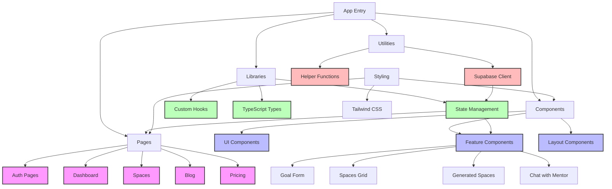
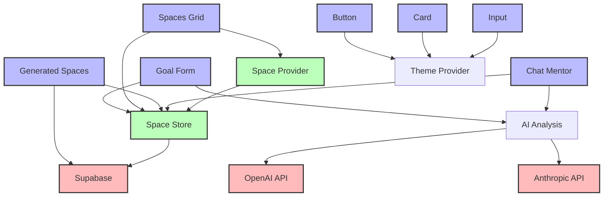
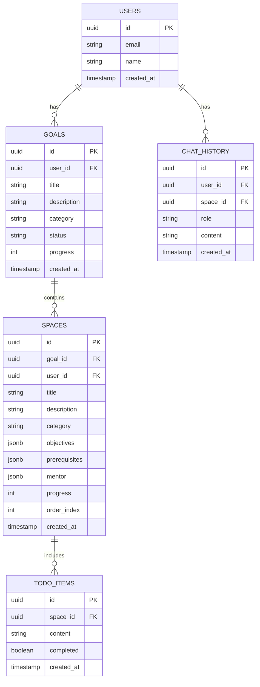
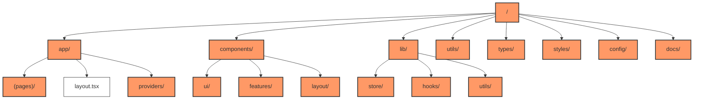

# GoalSpace Codebase Structure

## Main Architecture

```mermaid
graph TD
    %% Main Application Structure
    App[App Entry] --> Pages[Pages]
    App --> Components[Components]
    App --> Lib[Libraries]
    App --> Utils[Utilities]

    %% Pages Breakdown
    Pages --> Auth[Auth Pages]
    Pages --> Dashboard[Dashboard]
    Pages --> Spaces[Spaces]
    Pages --> Blog[Blog]
    Pages --> Pricing[Pricing]

    %% Components Organization
    Components --> UI[UI Components]
    Components --> Features[Feature Components]
    Components --> Layout[Layout Components]

    %% Feature Components Detail
    Features --> GoalForm[Goal Form]
    Features --> SpacesGrid[Spaces Grid]
    Features --> GeneratedSpaces[Generated Spaces]
    Features --> ChatMentor[Chat with Mentor]

    %% Libraries and Utils
    Lib --> Store[State Management]
    Lib --> Hooks[Custom Hooks]
    Lib --> Types[TypeScript Types]
    Utils --> Supabase[Supabase Client]
    Utils --> Helpers[Helper Functions]

    %% Data Flow
    Store --> Features
    Store --> Pages
    Supabase --> Store

    %% Styling
    Style[Styling] --> Tailwind[Tailwind CSS]
    Style --> Components
    Style --> Pages

    classDef page fill:#f9f,stroke:#333,stroke-width:2px
    classDef component fill:#bbf,stroke:#333,stroke-width:2px
    classDef library fill:#bfb,stroke:#333,stroke-width:2px
    classDef util fill:#fbb,stroke:#333,stroke-width:2px

    class Auth,Dashboard,Spaces,Blog,Pricing page
    class UI,Features,Layout component
    class Store,Hooks,Types library
    class Supabase,Helpers util
```

## Component Dependencies

```mermaid
flowchart TD
    %% Main Components
    GF[Goal Form] --> SS[Space Store]
    GF --> AI[AI Analysis]
    
    SG[Spaces Grid] --> SS
    SG --> SP[Space Provider]
    
    GS[Generated Spaces] --> SS
    GS --> SB[Supabase]
    
    %% Features
    CM[Chat Mentor] --> AI
    CM --> SS
    
    %% UI Components
    Button[Button] --> Theme[Theme Provider]
    Card[Card] --> Theme
    Input[Input] --> Theme
    
    %% Data Flow
    AI --> OpenAI[OpenAI API]
    AI --> Anthropic[Anthropic API]
    
    %% State Management
    SS --> SB
    SP --> SS
    
    classDef component fill:#bbf,stroke:#333,stroke-width:2px
    classDef store fill:#bfb,stroke:#333,stroke-width:2px
    classDef api fill:#fbb,stroke:#333,stroke-width:2px
    
    class GF,SG,GS,CM,Button,Card,Input component
    class SS,SP store
    class OpenAI,Anthropic,SB api
```

## Database Schema

```mermaid
erDiagram
    USERS ||--o{ GOALS : has
    GOALS ||--o{ SPACES : contains
    SPACES ||--o{ TODO_ITEMS : includes
    USERS ||--o{ CHAT_HISTORY : has
    
    USERS {
        uuid id PK
        string email
        string name
        timestamp created_at
    }
    
    GOALS {
        uuid id PK
        uuid user_id FK
        string title
        string description
        string category
        string status
        int progress
        timestamp created_at
    }
    
    SPACES {
        uuid id PK
        uuid goal_id FK
        uuid user_id FK
        string title
        string description
        string category
        jsonb objectives
        jsonb prerequisites
        jsonb mentor
        int progress
        int order_index
        timestamp created_at
    }
    
    TODO_ITEMS {
        uuid id PK
        uuid space_id FK
        string content
        boolean completed
        timestamp created_at
    }
    
    CHAT_HISTORY {
        uuid id PK
        uuid user_id FK
        uuid space_id FK
        string role
        string content
        timestamp created_at
    }
```

## File Structure

```mermaid
graph TD
    Root["/"] --> App["app/"]
    Root --> Components["components/"]
    Root --> Lib["lib/"]
    Root --> Utils["utils/"]
    Root --> Types["types/"]
    Root --> Styles["styles/"]
    Root --> Config["config/"]
    Root --> Docs["docs/"]
    
    App --> Pages["(pages)/"]
    App --> Layout["layout.tsx"]
    App --> Providers["providers/"]
    
    Components --> UI["ui/"]
    Components --> Features["features/"]
    Components --> Layout2["layout/"]
    
    Lib --> Store["store/"]
    Lib --> Hooks["hooks/"]
    Lib --> Utils2["utils/"]
    
    classDef folder fill:#f96,stroke:#333,stroke-width:2px
    classDef file fill:#fff,stroke:#333,stroke-width:1px
    
    class Root,App,Components,Lib,Utils,Types,Styles,Config,Docs,Pages,Providers,UI,Features,Layout2,Store,Hooks,Utils2 folder
    class Layout file
``` 