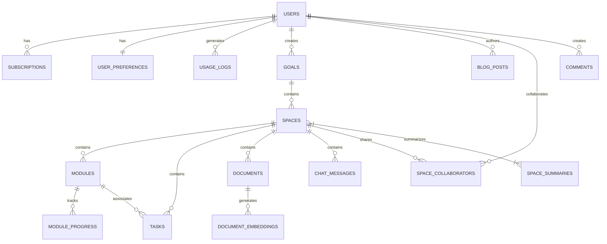

# GoalSpace Database Design Documentation

## Overview

This document outlines the database schema design for the GoalSpace application. The design prioritizes data integrity, performance, and scalability while supporting the core functionality of AI-powered goal achievement and learning management.

## Core Design Principles

1. **Data Integrity** - Enforced through foreign key constraints and proper relationship modeling
2. **Performance** - Optimized schema and indexing for common query patterns
3. **Scalability** - Designed to handle growth in users and content efficiently
4. **Security** - Row-level security policies to enforce data access controls
5. **Flexibility** - Balanced schema evolution capability with query optimization

## Schema Design

### 1. Core User System

```sql
-- Users table (core identity)
CREATE TABLE public.users (
    id UUID PRIMARY KEY REFERENCES auth.users,
    email TEXT UNIQUE NOT NULL,
    full_name TEXT,
    avatar_url TEXT,
    created_at TIMESTAMP WITH TIME ZONE DEFAULT NOW(),
    updated_at TIMESTAMP WITH TIME ZONE DEFAULT NOW(),
    last_active_at TIMESTAMP WITH TIME ZONE
);

-- User subscription management
CREATE TABLE public.subscriptions (
    id UUID PRIMARY KEY DEFAULT uuid_generate_v4(),
    user_id UUID NOT NULL REFERENCES public.users(id) ON DELETE CASCADE,
    tier TEXT NOT NULL CHECK (tier IN ('free', 'basic', 'pro', 'enterprise')),
    status TEXT NOT NULL CHECK (status IN ('active', 'canceled', 'past_due')),
    starts_at TIMESTAMP WITH TIME ZONE NOT NULL,
    ends_at TIMESTAMP WITH TIME ZONE,
    payment_provider TEXT,
    payment_reference TEXT,
    created_at TIMESTAMP WITH TIME ZONE DEFAULT NOW(),
    updated_at TIMESTAMP WITH TIME ZONE DEFAULT NOW()
);

-- User preferences (settings)
CREATE TABLE public.user_preferences (
    user_id UUID PRIMARY KEY REFERENCES public.users(id) ON DELETE CASCADE,
    theme TEXT DEFAULT 'system',
    language TEXT DEFAULT 'en',
    ai_model TEXT DEFAULT 'claude-3-haiku',
    notification_settings JSONB DEFAULT '{"email": true, "push": true}',
    created_at TIMESTAMP WITH TIME ZONE DEFAULT NOW(),
    updated_at TIMESTAMP WITH TIME ZONE DEFAULT NOW()
);

-- Usage tracking
CREATE TABLE public.usage_logs (
    id UUID PRIMARY KEY DEFAULT uuid_generate_v4(),
    user_id UUID NOT NULL REFERENCES public.users(id) ON DELETE CASCADE,
    resource_type TEXT NOT NULL,
    resource_id UUID,
    action TEXT NOT NULL,
    tokens_used INTEGER,
    created_at TIMESTAMP WITH TIME ZONE DEFAULT NOW()
);
```

### 2. Learning Content Structure

```sql
-- Goals table
CREATE TABLE public.goals (
    id UUID PRIMARY KEY DEFAULT uuid_generate_v4(),
    user_id UUID NOT NULL REFERENCES public.users(id) ON DELETE CASCADE,
    title TEXT NOT NULL,
    description TEXT,
    category TEXT,
    status TEXT NOT NULL DEFAULT 'active' CHECK (status IN ('active', 'completed', 'archived')),
    priority INTEGER DEFAULT 0,
    due_date TIMESTAMP WITH TIME ZONE,
    created_at TIMESTAMP WITH TIME ZONE DEFAULT NOW(),
    updated_at TIMESTAMP WITH TIME ZONE DEFAULT NOW(),
    UNIQUE (user_id, title)
);

-- Learning spaces
CREATE TABLE public.spaces (
    id UUID PRIMARY KEY DEFAULT uuid_generate_v4(),
    goal_id UUID NOT NULL REFERENCES public.goals(id) ON DELETE CASCADE,
    user_id UUID NOT NULL REFERENCES public.users(id) ON DELETE CASCADE,
    title TEXT NOT NULL,
    description TEXT,
    theme TEXT DEFAULT 'default',
    color_scheme TEXT DEFAULT 'blue',
    visibility TEXT NOT NULL DEFAULT 'private' CHECK (visibility IN ('private', 'public', 'shared')),
    ai_mentor_config JSONB DEFAULT '{"type": "default", "personality": "helpful", "expertise": []}',
    created_at TIMESTAMP WITH TIME ZONE DEFAULT NOW(),
    updated_at TIMESTAMP WITH TIME ZONE DEFAULT NOW(),
    UNIQUE (goal_id, title)
);

-- Content modules
CREATE TABLE public.modules (
    id UUID PRIMARY KEY DEFAULT uuid_generate_v4(),
    space_id UUID NOT NULL REFERENCES public.spaces(id) ON DELETE CASCADE,
    title TEXT NOT NULL,
    description TEXT,
    content_type TEXT NOT NULL CHECK (content_type IN ('text', 'video', 'audio', 'interactive')),
    content TEXT,
    order_index INTEGER NOT NULL DEFAULT 0,
    estimated_duration INTEGER, -- in minutes
    created_at TIMESTAMP WITH TIME ZONE DEFAULT NOW(),
    updated_at TIMESTAMP WITH TIME ZONE DEFAULT NOW()
);

-- Tasks
CREATE TABLE public.tasks (
    id UUID PRIMARY KEY DEFAULT uuid_generate_v4(),
    space_id UUID NOT NULL REFERENCES public.spaces(id) ON DELETE CASCADE,
    module_id UUID REFERENCES public.modules(id) ON DELETE SET NULL,
    title TEXT NOT NULL,
    description TEXT,
    status TEXT NOT NULL DEFAULT 'pending' CHECK (status IN ('pending', 'in_progress', 'completed')),
    due_date TIMESTAMP WITH TIME ZONE,
    priority TEXT DEFAULT 'medium' CHECK (priority IN ('low', 'medium', 'high', 'urgent')),
    created_at TIMESTAMP WITH TIME ZONE DEFAULT NOW(),
    updated_at TIMESTAMP WITH TIME ZONE DEFAULT NOW()
);
```

### 3. Knowledge and Communication

```sql
-- Knowledge base documents
CREATE TABLE public.documents (
    id UUID PRIMARY KEY DEFAULT uuid_generate_v4(),
    space_id UUID NOT NULL REFERENCES public.spaces(id) ON DELETE CASCADE,
    title TEXT NOT NULL,
    content TEXT NOT NULL,
    content_type TEXT DEFAULT 'markdown',
    created_at TIMESTAMP WITH TIME ZONE DEFAULT NOW(),
    updated_at TIMESTAMP WITH TIME ZONE DEFAULT NOW()
);

-- Document embeddings for vector search
CREATE TABLE public.document_embeddings (
    id UUID PRIMARY KEY DEFAULT uuid_generate_v4(),
    document_id UUID NOT NULL REFERENCES public.documents(id) ON DELETE CASCADE,
    chunk_index INTEGER NOT NULL,
    chunk_text TEXT NOT NULL,
    embedding VECTOR(1536) NOT NULL,
    created_at TIMESTAMP WITH TIME ZONE DEFAULT NOW(),
    UNIQUE (document_id, chunk_index)
);

-- Chat messages
CREATE TABLE public.chat_messages (
    id UUID PRIMARY KEY DEFAULT uuid_generate_v4(),
    space_id UUID NOT NULL REFERENCES public.spaces(id) ON DELETE CASCADE,
    user_id UUID NOT NULL REFERENCES public.users(id) ON DELETE CASCADE,
    is_from_user BOOLEAN NOT NULL DEFAULT true,
    message TEXT NOT NULL,
    metadata JSONB,
    created_at TIMESTAMP WITH TIME ZONE DEFAULT NOW()
);

-- Blog posts (public content)
CREATE TABLE public.blog_posts (
    id UUID PRIMARY KEY DEFAULT uuid_generate_v4(),
    author_id UUID REFERENCES public.users(id) ON DELETE SET NULL,
    title TEXT NOT NULL,
    slug TEXT NOT NULL UNIQUE,
    content TEXT NOT NULL,
    excerpt TEXT,
    published BOOLEAN DEFAULT false,
    published_at TIMESTAMP WITH TIME ZONE,
    created_at TIMESTAMP WITH TIME ZONE DEFAULT NOW(),
    updated_at TIMESTAMP WITH TIME ZONE DEFAULT NOW()
);
```

### 4. Progress Tracking and Analytics

```sql
-- Module completion records
CREATE TABLE public.module_progress (
    id UUID PRIMARY KEY DEFAULT uuid_generate_v4(),
    module_id UUID NOT NULL REFERENCES public.modules(id) ON DELETE CASCADE,
    user_id UUID NOT NULL REFERENCES public.users(id) ON DELETE CASCADE,
    completion_percentage INTEGER NOT NULL DEFAULT 0 CHECK (completion_percentage BETWEEN 0 AND 100),
    last_interaction_at TIMESTAMP WITH TIME ZONE,
    completed_at TIMESTAMP WITH TIME ZONE,
    created_at TIMESTAMP WITH TIME ZONE DEFAULT NOW(),
    updated_at TIMESTAMP WITH TIME ZONE DEFAULT NOW(),
    UNIQUE (module_id, user_id)
);

-- Space summary view (materialized)
CREATE MATERIALIZED VIEW public.space_summaries AS
SELECT 
    s.id AS space_id,
    s.user_id,
    s.goal_id,
    s.title,
    COUNT(DISTINCT m.id) AS total_modules,
    COUNT(DISTINCT t.id) AS total_tasks,
    COUNT(DISTINCT t.id) FILTER (WHERE t.status = 'completed') AS completed_tasks,
    COUNT(DISTINCT mp.module_id) FILTER (WHERE mp.completion_percentage = 100) AS completed_modules,
    CASE 
        WHEN COUNT(DISTINCT m.id) = 0 THEN 0
        ELSE ROUND((COUNT(DISTINCT mp.module_id) FILTER (WHERE mp.completion_percentage = 100) * 100.0 / COUNT(DISTINCT m.id))::numeric, 2)
    END AS overall_progress
FROM 
    public.spaces s
LEFT JOIN 
    public.modules m ON s.id = m.space_id
LEFT JOIN 
    public.tasks t ON s.id = t.space_id
LEFT JOIN 
    public.module_progress mp ON m.id = mp.module_id AND s.user_id = mp.user_id
GROUP BY 
    s.id, s.user_id, s.goal_id, s.title;
```

### 5. Sharing and Collaboration

```sql
-- Space sharing
CREATE TABLE public.space_collaborators (
    id UUID PRIMARY KEY DEFAULT uuid_generate_v4(),
    space_id UUID NOT NULL REFERENCES public.spaces(id) ON DELETE CASCADE,
    user_id UUID NOT NULL REFERENCES public.users(id) ON DELETE CASCADE,
    role TEXT NOT NULL DEFAULT 'viewer' CHECK (role IN ('viewer', 'editor', 'admin')),
    invited_at TIMESTAMP WITH TIME ZONE DEFAULT NOW(),
    accepted_at TIMESTAMP WITH TIME ZONE,
    created_at TIMESTAMP WITH TIME ZONE DEFAULT NOW(),
    updated_at TIMESTAMP WITH TIME ZONE DEFAULT NOW(),
    UNIQUE (space_id, user_id)
);

-- Content comments
CREATE TABLE public.comments (
    id UUID PRIMARY KEY DEFAULT uuid_generate_v4(),
    user_id UUID NOT NULL REFERENCES public.users(id) ON DELETE CASCADE,
    resource_type TEXT NOT NULL CHECK (resource_type IN ('module', 'document', 'task')),
    resource_id UUID NOT NULL,
    content TEXT NOT NULL,
    parent_id UUID REFERENCES public.comments(id) ON DELETE CASCADE,
    created_at TIMESTAMP WITH TIME ZONE DEFAULT NOW(),
    updated_at TIMESTAMP WITH TIME ZONE DEFAULT NOW()
);
```

## Entity Relationship Diagram



## Row-Level Security Policies

For all tables with user data, implement RLS policies to ensure users can only access their own data:

```sql
-- Example RLS policy for goals table
ALTER TABLE public.goals ENABLE ROW LEVEL SECURITY;

CREATE POLICY goals_select_policy ON public.goals
    FOR SELECT
    USING (user_id = auth.uid());

CREATE POLICY goals_insert_policy ON public.goals
    FOR INSERT
    WITH CHECK (user_id = auth.uid());

CREATE POLICY goals_update_policy ON public.goals
    FOR UPDATE
    USING (user_id = auth.uid());

CREATE POLICY goals_delete_policy ON public.goals
    FOR DELETE
    USING (user_id = auth.uid());
```

Similar policies should be implemented for all tables containing user data.

## Indexes

Strategic indexes for improved query performance:

```sql
-- Commonly queried fields
CREATE INDEX idx_spaces_user_id ON public.spaces(user_id);
CREATE INDEX idx_spaces_goal_id ON public.spaces(goal_id);
CREATE INDEX idx_modules_space_id ON public.modules(space_id);
CREATE INDEX idx_tasks_space_id ON public.tasks(space_id);
CREATE INDEX idx_tasks_module_id ON public.tasks(module_id);
CREATE INDEX idx_documents_space_id ON public.documents(space_id);
CREATE INDEX idx_chat_messages_space_id ON public.chat_messages(space_id);
CREATE INDEX idx_chat_messages_user_id ON public.chat_messages(user_id);

-- For sorting and filtering
CREATE INDEX idx_goals_created_at ON public.goals(created_at);
CREATE INDEX idx_tasks_due_date ON public.tasks(due_date);
CREATE INDEX idx_tasks_status ON public.tasks(status);

-- For vector search
CREATE INDEX idx_document_embeddings_vector ON public.document_embeddings USING ivfflat (embedding vector_cosine_ops);
```

## Migrations and Evolution

The database schema should be managed through versioned migrations using Supabase migrations or a tool like Prisma.

When making schema changes:
1. Create a new migration file
2. Test the migration against a development database
3. Include rollback instructions
4. Update TypeScript type definitions to match the new schema

## TypeScript Type Definitions

Type definitions in TypeScript should match the database schema exactly to prevent type mismatches:

```typescript
// Example type definitions for core tables
export interface User {
  id: string;
  email: string;
  full_name: string | null;
  avatar_url: string | null;
  created_at: string;
  updated_at: string;
  last_active_at: string | null;
}

export interface Goal {
  id: string;
  user_id: string;
  title: string;
  description: string | null;
  category: string | null;
  status: 'active' | 'completed' | 'archived';
  priority: number;
  due_date: string | null;
  created_at: string;
  updated_at: string;
}

export interface Space {
  id: string;
  goal_id: string;
  user_id: string;
  title: string;
  description: string | null;
  theme: string;
  color_scheme: string;
  visibility: 'private' | 'public' | 'shared';
  ai_mentor_config: {
    type: string;
    personality: string;
    expertise: string[];
  };
  created_at: string;
  updated_at: string;
}
```

## Performance Considerations

1. **Query Optimization**
   - Use materialized views for expensive calculations
   - Implement pagination for large result sets
   - Consider denormalization only for read-heavy scenarios

2. **Scaling Strategy**
   - Implement connection pooling
   - Consider read replicas for analytics queries
   - Use proper indexing strategy

3. **Maintenance**
   - Regularly refresh materialized views
   - Implement table partitioning for large tables (chat_messages, usage_logs)
   - Set up regular VACUUM and ANALYZE operations

## Data Integrity and Validation

1. **Application-Level Validation**
   - Implement Zod schemas for API endpoints
   - Validate all input before database operations

2. **Database Constraints**
   - Use CHECK constraints for value validation
   - Implement unique constraints to prevent duplicates
   - Enforce proper cascade behavior on foreign keys

## Migration Strategy from Current Schema

1. **Preparation Phase**
   - Create a complete backup of the current database
   - Map current data to new schema structure
   - Develop and test migration scripts

2. **Migration Execution**
   - Run migrations during a maintenance window
   - Implement data verification steps
   - Have rollback plan ready

3. **Post-Migration**
   - Update application code to work with new schema
   - Verify data integrity
   - Monitor performance
   - Update documentation

## Conclusion

This database design provides a solid foundation for the GoalSpace application, focusing on data integrity, performance, and scalability. The structured approach to content organization and user management supports the core functionality while allowing for future growth and feature expansion.

Regular reviews of query performance and schema evolution should be conducted as the application grows to ensure the database continues to meet the needs of the application efficiently.