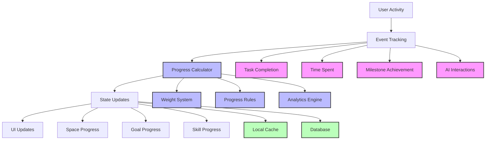

# Progress Tracking System Design

## System Overview



## Progress Metrics

### 1. Space Progress
- **Components**:
  - Task completion (40%)
  - Time engagement (20%)
  - Milestone achievements (30%)
  - AI interactions quality (10%)

- **Calculation**:
```typescript
interface SpaceProgress {
  taskProgress: number;    // 0-100
  timeProgress: number;    // 0-100
  milestoneProgress: number; // 0-100
  interactionScore: number;  // 0-100
  
  calculateTotal(): number {
    return (
      taskProgress * 0.4 +
      timeProgress * 0.2 +
      milestoneProgress * 0.3 +
      interactionScore * 0.1
    );
  }
}
```

### 2. Goal Progress
- **Components**:
  - Space completion average (60%)
  - Goal milestones (30%)
  - Extra activities (10%)

- **Calculation**:
```typescript
interface GoalProgress {
  spaceProgresses: number[];  // Array of space progress
  milestonesCompleted: number;
  extraActivities: number;
  
  calculateTotal(): number {
    const avgSpaceProgress = average(spaceProgresses);
    const milestoneScore = (milestonesCompleted / totalMilestones) * 100;
    const extraScore = Math.min(extraActivities * 10, 100);
    
    return (
      avgSpaceProgress * 0.6 +
      milestoneScore * 0.3 +
      extraScore * 0.1
    );
  }
}
```

### 3. Skill Progress
- **Components**:
  - Practice time (40%)
  - Task mastery (40%)
  - Peer reviews (20%)

## Implementation Details

### 1. Event Tracking
```typescript
interface ProgressEvent {
  type: 'task' | 'time' | 'milestone' | 'interaction';
  spaceId: string;
  goalId: string;
  value: number;
  metadata?: Record<string, any>;
  timestamp: Date;
}

class ProgressTracker {
  async trackEvent(event: ProgressEvent) {
    // 1. Validate event
    // 2. Store event
    // 3. Trigger progress recalculation
    // 4. Update UI
  }
}
```

### 2. Progress Rules
```typescript
interface ProgressRule {
  type: string;
  condition: (event: ProgressEvent) => boolean;
  calculate: (events: ProgressEvent[]) => number;
  weight: number;
}

const progressRules: ProgressRule[] = [
  {
    type: 'task',
    condition: (event) => event.type === 'task',
    calculate: (events) => {
      const completed = events.filter(e => e.value === 100).length;
      return (completed / events.length) * 100;
    },
    weight: 0.4
  },
  // ... other rules
];
```

### 3. Database Schema Updates

```sql
-- Progress Events Table
CREATE TABLE progress_events (
  id UUID PRIMARY KEY DEFAULT uuid_generate_v4(),
  user_id UUID REFERENCES users(id),
  space_id UUID REFERENCES spaces(id),
  goal_id UUID REFERENCES goals(id),
  event_type TEXT NOT NULL,
  value NUMERIC NOT NULL,
  metadata JSONB,
  created_at TIMESTAMP WITH TIME ZONE DEFAULT NOW()
);

-- Progress Snapshots Table
CREATE TABLE progress_snapshots (
  id UUID PRIMARY KEY DEFAULT uuid_generate_v4(),
  user_id UUID REFERENCES users(id),
  space_id UUID REFERENCES spaces(id),
  goal_id UUID REFERENCES goals(id),
  total_progress NUMERIC NOT NULL,
  components JSONB NOT NULL,
  created_at TIMESTAMP WITH TIME ZONE DEFAULT NOW()
);
```

## UI Components

### 1. Progress Indicators
```typescript
interface ProgressIndicator {
  type: 'circular' | 'linear' | 'detailed';
  value: number;
  showComponents?: boolean;
  animate?: boolean;
}
```

### 2. Progress Analytics
```typescript
interface ProgressAnalytics {
  timeSpent: {
    daily: number[];
    weekly: number[];
    monthly: number[];
  };
  completionRate: number;
  strongestAreas: string[];
  improvementAreas: string[];
}
```

## Implementation Plan

### Phase 1: Core Tracking
1. Implement basic event tracking
2. Set up progress calculation engine
3. Update database schema
4. Create basic UI components

### Phase 2: Advanced Features
1. Add analytics engine
2. Implement milestone system
3. Add AI interaction scoring
4. Create detailed progress views

### Phase 3: Optimization
1. Add caching layer
2. Implement batch updates
3. Add progress predictions
4. Create progress insights

## Usage Example

```typescript
// Track a task completion
progressTracker.trackEvent({
  type: 'task',
  spaceId: 'space123',
  goalId: 'goal456',
  value: 100,
  metadata: {
    taskType: 'coding',
    difficulty: 'medium'
  }
});

// Get space progress
const progress = await progressCalculator.getSpaceProgress('space123');
console.log(`Space Progress: ${progress.total}%`);
console.log('Components:', progress.components);
``` 