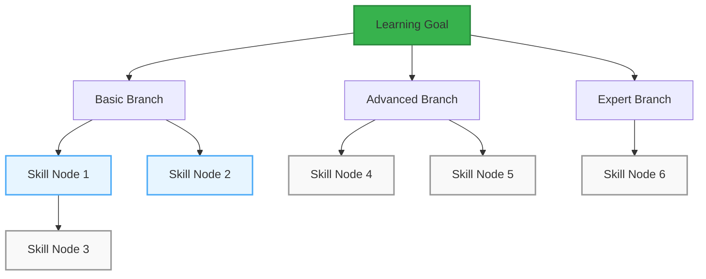

# Skill Tree Progress System - MVP

## System Overview



## Core Concepts

### 1. Skill Nodes
```typescript
interface SkillNode {
  id: string;
  title: string;
  description: string;
  type: 'task' | 'milestone' | 'practice';
  status: 'locked' | 'unlocked' | 'completed';
  xp: number;  // Experience points for completing
  requirements: {
    parentNodes: string[];  // IDs of nodes that must be completed first
    minLevel: number;       // Minimum level required
  };
}
```

### 2. Experience Points (XP)
```typescript
interface UserProgress {
  currentLevel: number;
  totalXP: number;
  currentLevelXP: number;
  xpToNextLevel: number;
  
  // XP thresholds per level
  readonly XP_LEVELS = {
    1: 0,
    2: 100,
    3: 250,
    4: 500,
    5: 1000
  };
}
```

### 3. Achievement System
```typescript
interface Achievement {
  id: string;
  title: string;
  description: string;
  type: 'milestone' | 'streak' | 'mastery';
  xpReward: number;
  icon: string;
  unlockedAt?: Date;
}

const ACHIEVEMENTS = [
  {
    id: 'first_step',
    title: 'First Step',
    description: 'Complete your first skill node',
    type: 'milestone',
    xpReward: 50,
    icon: '🌱'
  },
  {
    id: 'quick_learner',
    title: 'Quick Learner',
    description: 'Complete 3 skills in one day',
    type: 'streak',
    xpReward: 100,
    icon: '⚡'
  }
];
```

## Database Schema

```sql
-- Skill Nodes Table
CREATE TABLE skill_nodes (
  id UUID PRIMARY KEY DEFAULT uuid_generate_v4(),
  space_id UUID REFERENCES spaces(id),
  title TEXT NOT NULL,
  description TEXT,
  type TEXT NOT NULL,
  xp INTEGER NOT NULL,
  requirements JSONB,
  created_at TIMESTAMP WITH TIME ZONE DEFAULT NOW()
);

-- User Progress Table
CREATE TABLE user_progress (
  id UUID PRIMARY KEY DEFAULT uuid_generate_v4(),
  user_id UUID REFERENCES users(id),
  space_id UUID REFERENCES spaces(id),
  node_id UUID REFERENCES skill_nodes(id),
  status TEXT NOT NULL,
  xp_earned INTEGER DEFAULT 0,
  completed_at TIMESTAMP WITH TIME ZONE,
  created_at TIMESTAMP WITH TIME ZONE DEFAULT NOW()
);

-- Achievements Table
CREATE TABLE user_achievements (
  id UUID PRIMARY KEY DEFAULT uuid_generate_v4(),
  user_id UUID REFERENCES users(id),
  achievement_id TEXT NOT NULL,
  unlocked_at TIMESTAMP WITH TIME ZONE DEFAULT NOW()
);
```

## Progress Logic

### 1. Node Unlocking
```typescript
function canUnlockNode(node: SkillNode, userProgress: UserProgress): boolean {
  // Check if all parent nodes are completed
  const parentsCompleted = node.requirements.parentNodes.every(
    parentId => isNodeCompleted(parentId, userProgress)
  );
  
  // Check if user meets level requirement
  const hasLevel = userProgress.currentLevel >= node.requirements.minLevel;
  
  return parentsCompleted && hasLevel;
}
```

### 2. XP Calculation
```typescript
function calculateXP(
  action: 'complete_node' | 'streak' | 'achievement',
  metadata: Record<string, any>
): number {
  switch (action) {
    case 'complete_node':
      return metadata.node.xp * (metadata.perfectScore ? 1.5 : 1);
    case 'streak':
      return 50 * metadata.daysInStreak;
    case 'achievement':
      return metadata.achievement.xpReward;
    default:
      return 0;
  }
}
```

## UI Components

### 1. Skill Tree Visualization
```typescript
interface SkillTreeProps {
  nodes: SkillNode[];
  userProgress: UserProgress;
  onNodeClick: (node: SkillNode) => void;
}

// Implementation will use a canvas or SVG for tree visualization
// with interactive nodes and progress indicators
```

### 2. Progress Bar
```typescript
interface ProgressBarProps {
  currentXP: number;
  nextLevelXP: number;
  level: number;
  showAnimation?: boolean;
}
```

### 3. Achievement Toast
```typescript
interface AchievementToast {
  achievement: Achievement;
  xpGained: number;
  onClose: () => void;
}
```

## Implementation Steps

### Phase 1: Basic Structure (Week 1)
1. Create skill nodes table and basic tree structure
2. Implement node unlocking logic
3. Build basic tree visualization
4. Add XP system

### Phase 2: Gamification (Week 2)
1. Add achievements system
2. Implement progress animations
3. Add sound effects and visual feedback
4. Create reward notifications

### Phase 3: Polish (Week 3)
1. Add progress persistence
2. Implement streaks
3. Add social features (optional)
4. Create leaderboards (optional)

## Example Usage

```typescript
// Track node completion
async function completeNode(nodeId: string, userId: string) {
  // 1. Mark node as completed
  await updateNodeStatus(nodeId, 'completed');
  
  // 2. Calculate and award XP
  const node = await getNode(nodeId);
  const xp = calculateXP('complete_node', { node, perfectScore: true });
  await awardXP(userId, xp);
  
  // 3. Check and unlock achievements
  const unlockedAchievements = await checkAchievements(userId);
  if (unlockedAchievements.length > 0) {
    await processAchievements(userId, unlockedAchievements);
  }
  
  // 4. Check and unlock connected nodes
  const connectedNodes = await getConnectedNodes(nodeId);
  for (const node of connectedNodes) {
    if (await canUnlockNode(node, userProgress)) {
      await updateNodeStatus(node.id, 'unlocked');
    }
  }
}
``` 